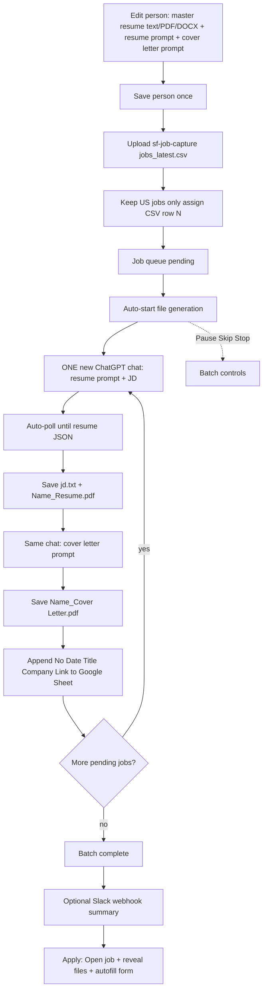

# Brightstar Bid bot (Chrome Extension)

> Formerly developed as Resume GPT Builder.

Generate tailored resumes and cover letters from a CSV of jobs (or one-off JDs) by driving your open ChatGPT tab. Each person sets a **master resume** (text / PDF / DOCX — not JSON) and prompts once, then reuses them.

## What it does

- **Active person**: name, contact, master resume, **resume tailor prompt** (JD auto from CSV), cover letter prompt, PDF prefix, template
- **CSV batch**: upload sf-job-capture (or similar) `jobs_latest.csv` → keep **US jobs only** → filter by **Dice / LI / Etc / All**. **Dice jobs** always interleaved generate → auto-apply+submit (Start also applies already-built not-Applied Dice rows); non-Dice jobs only build files.
- For each job: **one new ChatGPT chat** → resume JSON (JD auto-injected) → save files → **same chat** cover letter → next job
- Saves under `Downloads / Applications-{Person} / [N] - [Company] - [Title] /` (only these three files):
  - `jd.txt`
  - `[Name]_Resume.pdf` (US senior templates — ATS, Silicon Valley, consulting, NYC finance, executive)
  - `[Name]_Cover Letter.pdf` (body + signature only — no top header block)
  - `N` = CSV data row number (1 = first job after the header); `[Name]` from the person / PDF prefix (e.g. Sandeep)
- **Apply assist**: Open job URL, reveal saved files, autofill name/email/phone/LinkedIn on the application page
- Manual one-off job still available (also auto — no JSON paste)

### Unattended run (v1.4)

The batch is designed to finish a whole CSV without supervision:

- **Fresh chat guaranteed** — each job navigates the tab to a blank chat, so a job can never harvest the previous job's JSON
- **Deep DOM recognition** — scans up to 20 assistant turns + all page `<pre>`/JSON code blocks (retries used to hide the good JSON outside a 3-message window); curly quotes are normalized
- **No auto re-prompt spam** — does not send “not usable” retry prompts when JSON is already on the page; click **Save JSON now** if needed
- **JSON ready flag** — after ChatGPT finishes streaming, waits ~2.5s for the DOM to settle, then sets `chatgpt_json_ready` and saves files
- **Short resumes work** — 1–2 employers, or no certifications, no longer blocks the run (only genuine schema/placeholder output is rejected)
- **A bad row no longer stops the batch** — the row is retried once, then marked `failed` and the queue moves on. Click **Start** again to retry failed rows
- **Downloads are verified** — a file counts as saved only when Chrome reports it complete; interruptions surface as errors instead of silent success
- **PDFs render in a background tab** and retry automatically (the last retry uses a visible tab)
- **Self-healing** — a missing ChatGPT tab is opened automatically, and a batch interrupted by a browser restart or a sleeping service worker resumes on its own

## Workflow



**One-off path:** Manual one-off job → same resume chat → poll JSON → save → cover letter (no CSV row prefix on the folder).

## Setup

1. Open `chrome://extensions`
2. Enable **Developer mode**
3. Click **Load unpacked**
4. Select this extension folder
5. Open `https://chatgpt.com` and stay logged in

## First-time person setup

1. Open the extension → **Person**
2. Upload a **.txt / .pdf / .docx** resume (or paste the text). Contact, tailor prompt, cover-letter prompt, and employers fill automatically and the person is saved as Active
3. Review the gold notice, then generate from CSV. Edit person only if you need to tweak a field
4. Built-in presets are optional. Saving a built-in creates your own copy.

## CSV batch

1. Upload a CSV with columns like `title`, `organization`, `location`, `remote_restricted_to`, `url`, `description` (typical path: `sf-job-capture/download/jobs_latest.csv`)
2. Choose **Apply source** filter (default **Dice**) to choose which jobs appear in the queue:
   - **Dice** — Dice.com jobs only
   - **LI** — LinkedIn-hosted jobs only
   - **Etc** — not Dice and not LinkedIn
   - **All** — every US job
3. Confirm summary counts (Dice / LI / Etc)
4. File generation **starts automatically** after upload (ChatGPT tab opens if needed). Use **Start** only to resume after Pause / failed rows / apply backlog
5. Use **Pause** / **Skip** / **Stop** as needed
6. Per row: **Open** (JD link), **Files** (reveal downloads), **Apply** (manual assist; stops before Submit)

### Dice interleaved auto-apply

**Per job type** (not only when the Dice filter is selected):

- **Dice job** after files are built: open wizard/ATS → autofill + upload that row’s PDFs → **Submit** → close tab → cooldown → next job
- **Start** also drains already-built Dice rows that are not Applied yet
- **Non-Dice job**: build files only; use manual Apply if you want assist (stops before Submit)
- Blockers mark `applyAttempted` and continue — that row is not auto-retried in the same batch

### CSV auto-source (cron / 12h updates)

Use these when `jobs_latest.csv` is rewritten on a schedule:

| Approach | How |
|----------|-----|
| **Refresh CSV** | One click — re-reads pinned file, then URL, then asks the native host |
| **Pin local CSV** | File System Access: pick the file once, enable poll, bot re-reads on a timer |
| **CSV URL** | Publish the file over http(s); enable URL poll + interval |
| **Native watcher** | Instant OS file-watch via `native-host/` (Windows installer included) |

**Native host (Windows):**

```powershell
cd native-host
.\install-windows.ps1 -ExtensionId <id-from-chrome-extensions> -CsvPath "D:\Work\JobHunting\Prompts\Bots\sf-job-capture\download\jobs_latest.csv"
```

Then enable **Native OS watcher** in Auto-source settings and **Save**. Refreshes **merge** by job link (keep done/skipped; add new pending), sheet-dedupe, and auto-start generation when new jobs appear.

## Keep the bot open while you bid

Chrome always closes an extension popup when you click outside it, so copying a JD or link dismisses it. Click **Keep open** (top-right of the popup) to move the same UI into Chrome's **side panel**, which stays docked while you browse and copy. On Chrome builds without the side panel it opens a detached window instead.

The **Manual one-off** form also remembers whether it was expanded, and collapses itself once **Generate (auto)** starts.

## Apply autofill

- Queue **Apply** / **Autofill this page** / **Auto Apply** (`Ctrl+Shift+Y` / `Ctrl+Shift+U`)
- Fills name/email/phone/LinkedIn from the active person, then extras + saved Q&A
- Manual Auto Apply **stops before Submit** so you can review
- **Dice** channel batch mode: Start applies already-built not-Applied rows, then auto-submits after each new build (see Dice interleaved above)
- Leftover questions go to **OpenAI** if `.env` has `OPENAI_API_KEY` (copy `.env.example` → `.env`, then reload the extension). Do not commit `.env`.
- **Q&A bank** (Apply section): Open editor, **Load bundled bank** (`qa-bank-custom-steven-avon.json`), or Import JSON. Imports are assigned to the **active person** so autofill can match them. Learn mode saves answers you type on forms.

## Output folder naming

```
Downloads / Applications-Lewis / 12 - Acme Inc - Senior Salesforce Developer /
  jd.txt
  Lewis_Resume.pdf
  Lewis_Cover Letter.pdf
```

The output folder follows the active person (`Applications-{ResumePrefix}` from the PDF prefix, e.g. `Lewis_Resume` → `Applications-Lewis`). Legacy `Resume Applications` folders are still found for Apply.

## Notes

- Keep the ChatGPT tab open while the batch runs
- Resume prompts must ask ChatGPT for **JSON only** (the extension polls and parses it — you do not paste JSON)
- Master resume is **plain text / PDF / DOCX**, never the ChatGPT JSON output
- Output path is relative to Chrome's **Downloads** folder
- After code changes, click **Reload** on the extension card in `chrome://extensions`
- Profiles live in this Chrome profile's `storage.local` (each teammate can save their own person)

## Google Spreadsheet (optional)

After each job’s files finish (batch or one-off), the extension can append a row:

| No | Date | Title | Company | Link | Salary | Status |
|----|------|-------|---------|------|--------|--------|
| CSV row # | M/D/YYYY | job title | company | JD URL | (optional) | Ready, then Applied M/D/YYYY |

**Status column:** CSV batch resume build writes **Ready**. A successful **manual one-off** bid writes **Applied M/D/YYYY** immediately. Clicking **Apply** in the queue also sets **Applied M/D/YYYY** (the day you clicked Apply — column B stays the resume-build date). On the **Dice** interleaved path, **Applied** is set only after a successful Submit. Duplicate-by-link still skips jobs that are already on the sheet.

**Duplicate prevention:** when you upload a CSV (and again when a batch starts), the bot reads existing **Link** values from the sheet and skips any job whose JD URL already appears there (tracking params / trailing slashes are normalized). Skipped duplicates are marked in the queue and Slack is alerted. Append also refuses to re-add the same link.

Chrome cannot write from the spreadsheet share link alone:

1. Open your sheet → put those headers in row 1 (optional but recommended)
2. Extensions → Apps Script → paste `apps-script/Code.gs` (or use **Copy script** in the popup) → Save
3. Deploy → New deployment → Web app → Execute as: **Me**, Who has access: **Anyone**
4. Paste the spreadsheet link and Web App URL into the extension’s **Google Sheet** section
5. Reload the extension if you just changed code; values persist in `storage.local`
6. After updating the Apps Script, create a **new deployment** (or “Manage deployments → Edit → Version: New”) so `listLinks` / `markApplied` are live

If sheet append fails, file generation still succeeds — the status line will note the sheet error.

## Slack alert (optional)

With a webhook configured, Slack only pings when something needs attention — plus a final batch summary:

- **Job failed ❌** — row exhausted retries (error message + attempt N/M)
- **Job error ⚠️** — retrying (error message + attempt N/M)
- **Batch complete** — done / failed / skipped counts (with up to 15 error lines)
- **Batch paused / fatal failure** — blocker or uncaught runner error

Successful jobs do **not** ping Slack (to keep the channel quiet).

1. In Slack: create an **Incoming Webhook** for the channel you want (Apps → Incoming WebHooks, or [api.slack.com/apps](https://api.slack.com/apps) → Incoming Webhooks)
2. Copy the `https://hooks.slack.com/services/...` URL
3. Paste it into the extension’s **6 · Slack alert** section
4. Click **Test** to verify the message appears in that channel
5. Reload the extension if you just changed code

Leave the field blank to skip Slack. Notify failures do not stop the batch.
