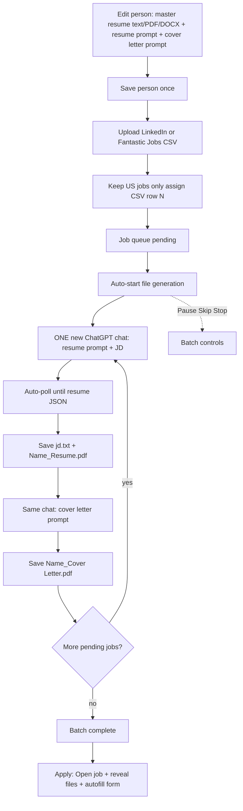

# Brightstar Bid bot (Chrome Extension)

> Formerly developed as Resume GPT Builder.

Generate tailored resumes and cover letters from a CSV of jobs (or one-off JDs) by driving your open ChatGPT tab. Each person sets a **master resume** (text / PDF / DOCX — not JSON) and prompts once, then reuses them.

## What it does

- **Active person**: name, contact, master resume, **resume tailor prompt** (JD auto from CSV), cover letter prompt, PDF prefix, template
- **CSV batch**: upload LinkedIn / Fantastic Jobs CSV → keep **US jobs only** → **auto-starts file generation** (Start / Pause / Skip / Stop still available)
- For each job: **one new ChatGPT chat** → resume JSON (JD auto-injected) → save files → **same chat** cover letter → next job
- Saves under `Downloads / [output folder] / [N] - [Company] - [Title] /` (only these three files):
  - `jd.txt`
  - `[Name]_Resume.pdf` (Times Classic / Developer Style layout with cert badges)
  - `[Name]_Cover Letter.pdf` (body + signature only — no top header block)
  - `N` = CSV data row number (1 = first job after the header); `[Name]` from the person / PDF prefix (e.g. Matthew)
- **Apply assist**: Open job URL, reveal saved files, autofill name/email/phone/LinkedIn on the application page
- Manual one-off job still available (also auto — no JSON paste)

### Unattended run (v1.4)

The batch is designed to finish a whole CSV without supervision:

- **Fresh chat guaranteed** — each job navigates the tab to a blank chat, so a job can never harvest the previous job's JSON
- **Deep DOM recognition** — scans up to 20 assistant turns + all page `<pre>`/JSON code blocks (retries used to hide the good JSON outside a 3-message window); curly quotes are normalized
- **No auto re-prompt spam** — does not send “not usable” retry prompts when JSON is already on the page; click **Save JSON now** if needed
- **JSON ready flag** — after ChatGPT finishes streaming, waits ~2.5s for the DOM to settle, then sets `chatgpt_json_ready` and saves files
- **Short resumes work** — 1–2 employers, or no certifications, no longer blocks the run (only genuine schema/placeholder output is rejected)
- **A bad row no longer stops the batch** — the row is retried once, then marked `failed` and the queue moves on. Click **Start** again to retry failed rows
- **Downloads are verified** — a file counts as saved only when Chrome reports it complete; interruptions surface as errors instead of silent success
- **PDFs render in a background tab** and retry automatically (the last retry uses a visible tab)
- **Self-healing** — a missing ChatGPT tab is opened automatically, and a batch interrupted by a browser restart or a sleeping service worker resumes on its own

## Workflow



**One-off path:** Manual one-off job → same resume chat → poll JSON → save → cover letter (no CSV row prefix on the folder).

## Setup

1. Open `chrome://extensions`
2. Enable **Developer mode**
3. Click **Load unpacked**
4. Select this extension folder
5. Open `https://chatgpt.com` and stay logged in

## First-time person setup

1. Open the extension → **Edit person / master resume / prompts**
2. Optionally **Load** the Matthew built-in preset
3. Paste your **master resume as text**, or upload **.txt / .pdf / .docx** (not JSON)
4. Set the **resume tailor prompt** — ChatGPT instructions to rewrite the resume. Put `{JD}` where each job’s description should go; the batch **fills it from the CSV automatically** (do not paste JDs into the prompt). Also: `{MASTER_RESUME}`, `{JOB_TITLE}`, `{COMPANY}`, `{NAME}`, `{EMAIL}`, `{PHONE}`, `{LINKEDIN}`, `{LOCATION}`
5. Optionally set a **cover letter prompt** (same rule: `{JD}` = auto from CSV)
6. Fill contact fields (used for cover letter signature + apply autofill)
7. Click **Save as my person** / **Save changes** (green confirmation appears above the button). Built-in presets are read-only — saving creates your own copy and selects it as Active person.

## CSV batch

1. Upload a CSV with columns like `title`, `organization`, `location`, `remote_restricted_to`, `url`, `description`
2. Choose **Apply source** filter:
   - **General** (default) — non-LinkedIn / ATS jobs (easier to apply)
   - **LI** — LinkedIn-hosted jobs only
   - **All** — every US job
3. Confirm summary counts (General vs LI)
4. File generation **starts automatically** after upload (ChatGPT tab opens if needed). Use **Start** only to resume after Pause / failed rows
5. Use **Pause** / **Skip** / **Stop** as needed
6. Per row: **Open** (JD link), **Files** (reveal downloads), **Apply** (open + reveal + autofill)

## Apply autofill

- Button: **Autofill this page** (focus the application tab first)
- Hotkey: **Ctrl+Shift+Y** (Mac: Command+Shift+Y)
- Best-effort on common name/email/phone/LinkedIn fields — attach the PDF from the saved folder yourself

## Output folder naming

```
Downloads / Resume Applications / 12 - Acme Inc - Senior Salesforce Developer /
  jd.txt
  Matthew_Resume.pdf
  Matthew_Cover Letter.pdf
```

Manual one-off jobs (no CSV row) still use `Company - Title` without the numeric prefix.

## Notes

- Keep the ChatGPT tab open while the batch runs
- Resume prompts must ask ChatGPT for **JSON only** (the extension polls and parses it — you do not paste JSON)
- Master resume is **plain text / PDF / DOCX**, never the ChatGPT JSON output
- Output path is relative to Chrome's **Downloads** folder
- After code changes, click **Reload** on the extension card in `chrome://extensions`
- Profiles live in this Chrome profile's `storage.local` (each teammate can save their own person)

## Google Spreadsheet (optional)

Chrome cannot write to a spreadsheet from the share/edit link alone. Use the Apps Script under `apps-script/Code.gs` if you re-enable the spreadsheet section in the popup.
