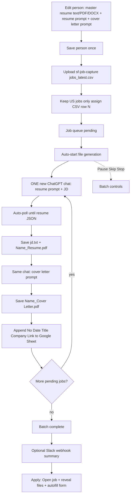

# Brightstar Bid bot (Chrome Extension)

> Formerly developed as Resume GPT Builder.

Generate tailored resumes and cover letters from a CSV of jobs (or one-off JDs) by driving your open **ChatGPT or Claude** tab. Each person sets a **master resume** (text / PDF / DOCX — not JSON) and prompts once, then reuses them.

## What it does

- **Active person**: name, contact, master resume, **resume tailor prompt** (JD auto from CSV), cover letter prompt, PDF prefix, template
- **Job capture / CSV batch**: upload sf-job-capture (or similar) `jobs_latest.csv`, or **grab a selected Indeed job** → keep **US jobs only** → filter by **Dice / Indeed / LI / Etc / All** using the **job link host**. Hosted Dice and Indeed jobs interleave generate → auto-apply+submit; external Indeed applications are never submitted.
- For each job: **one new chat** on the selected AI engine (ChatGPT or Claude) → resume JSON (JD auto-injected) → save files → **same chat** cover letter → next job
- Toggle **AI engine** in the bot UI anytime before Start / Grab (stay logged in on that site)
- During the **cooldown between jobs**, the finished chat is deleted so AI history stays tidy
## Engineering tracks (SF / DE / FS / AI)

Each person has a default **engineering track** that selects the resume engine, JD skill catalog, and default tailor/cover-letter prompts:

| Track | Roles |
|-------|--------|
| **SF** | Salesforce (built-in D'mario / Edrwin presets + generic SF template) |
| **DE** | Data Engineering — Snowflake, dbt, Airflow, Kafka, etc. |
| **FS** | Full Stack — React, Node.js, TypeScript, cloud, CI/CD |
| **AI** | AI / ML Evaluation — LLM quality, eval pipelines, Python/SQL |

- Set **Engineering track** under **Active person** (top of Section 1). It applies immediately to **CSV batch** and **manual one-off** runs — prompts and ATS engine switch for the session.
- Click **Save person** to persist the track and prompts as that person’s default. Changing track without saving is session-only (safe for experiments).
- Built-in Salesforce presets (D'mario / Edrwin) keep their embedded SF prompts when track is SF; other tracks use the matching track template at runtime.

After each resume build, calculate a local **ATS match score (0–100)** from JD keywords, title alignment, domain products (Salesforce, data tools, stack, or AI tools depending on track), experience evidence, and resume structure; hover its queue badge for the breakdown
- Saves under `Downloads / Applications-{Person} / [N] - [Company] - [Title] /` (only these three files):
  - `jd.txt`
  - `[Name]_Resume.pdf` (US senior templates — ATS, Silicon Valley, consulting, NYC finance, executive)
  - `[Name]_Cover Letter.pdf` (body + signature only — no top header block)
  - `N` = CSV data row number (1 = first job after the header); `[Name]` from the person / PDF prefix (e.g. Sandeep)
- **Apply assist**: Open job URL, reveal saved files, autofill name/email/phone/LinkedIn on the application page
- Manual one-off job still available (also auto — no JSON paste)

### Unattended run (v1.4)

The batch is designed to finish a whole CSV without supervision:

- **Fresh chat guaranteed** — each job navigates the tab to a blank chat, so a job can never harvest the previous job's JSON
- **Deep DOM recognition** — scans up to 20 assistant turns + all page `<pre>`/JSON code blocks (retries used to hide the good JSON outside a 3-message window); curly quotes are normalized
- **No auto re-prompt spam** — does not send “not usable” retry prompts when JSON is already on the page; click **Save JSON now** if needed
- **JSON ready flag** — after ChatGPT finishes streaming, waits ~2.5s for the DOM to settle, then sets `chatgpt_json_ready` and saves files
- **Short resumes work** — 1–2 employers, or no certifications, no longer blocks the run (only genuine schema/placeholder output is rejected)
- **A bad row no longer stops the batch** — the row is retried once, then marked `failed` and the queue moves on. Click **Start** again to retry failed rows
- **Downloads are verified** — a file counts as saved only when Chrome reports it complete; interruptions surface as errors instead of silent success
- **PDFs render in a background tab** and retry automatically (the last retry uses a visible tab)
- **Self-healing** — a missing ChatGPT tab is opened automatically, and a batch interrupted by a browser restart or a sleeping service worker resumes on its own

## Workflow



**One-off path:** Manual one-off job → same resume chat → poll JSON → save → cover letter (no CSV row prefix on the folder).

## Setup

1. Open `chrome://extensions`
2. Enable **Developer mode**
3. Click **Load unpacked**
4. Select this extension folder
5. Open `https://chatgpt.com` or `https://claude.ai` (match the AI engine toggle) and stay logged in

## First-time person setup

1. Open the extension → **Person**
2. Upload a **.txt / .pdf / .docx** resume (or paste the text). Contact, tailor prompt, cover-letter prompt, and employers fill automatically and the person is saved as Active
3. Review the gold notice, then generate from CSV. Edit person only if you need to tweak a field
4. Built-in presets are optional. Saving a built-in creates your own copy.

## CSV batch

1. Upload a CSV with columns like `title`, `organization`, `location`, `remote_restricted_to`, `url`, `description` (typical path: `sf-job-capture/download/jobs_latest.csv`)
2. Choose **Source** filter (default **Dice**) — classified by **job URL host** only (`dice.com`, `linkedin.com`, `indeed.com`; everything else is Etc):
   - **Dice** — `*.dice.com` links
   - **Indeed** — `*.indeed.com` links
   - **LI** — `*.linkedin.com` links
   - **Etc** — any other application URL (CSV `source` labels are ignored)
   - **All** — every US job
3. Confirm summary counts (Dice / Indeed / LI / Etc)
4. Review the queue before generation. Use the external-link icon to verify relevance and the trash icon to exclude unsuitable jobs from this and future refreshes.
5. Click **Start** only after the queue is approved; CSV upload and refresh never start generation automatically.
6. Use **Pause** / **Skip** / **Stop** as needed. Per row, **Files** reveals downloads and **Apply** runs manual assistance.

### Dice interleaved auto-apply

**Per job type** (not only when the Dice filter is selected):

- **Dice job** after files are built: open wizard/ATS → autofill + upload that row’s PDFs → **Submit** → close tab → cooldown → next job
- **Start** also drains already-built Dice rows that are not Applied yet
- **Non-Dice job**: build files only; use manual Apply if you want assist (stops before Submit)
- Blockers mark `applyAttempted` and continue — that row is not auto-retried in the same batch

### Indeed selected-job grab and auto-apply

1. Sign in to Indeed in the same Chrome profile that has the unpacked extension installed.
2. Filter search results yourself and select a job so the detail pane is visible.
3. Choose **ChatGPT** or **Claude** under **AI engine**, then click **Grab & auto-apply**. It scrapes title / company / JD / link / salary, generates files on that AI tab, appends the Google Sheet, removes that job’s AI chat, and submits Apply-on-Indeed applications only.
4. Use **Grab to queue only** if you want review before Start.
5. Sign-in screens, CAPTCHA/rate limits, unanswered required fields, external company links, and unconfirmed submissions stop or pause safely with the application tab left open.

Keep the scan bounded. Large or rapid Indeed activity is more likely to trigger anti-automation controls.

### CSV auto-source (cron / 12h updates)

Use these when `jobs_latest.csv` is rewritten on a schedule:

| Approach | How |
|----------|-----|
| **Refresh CSV** | One click — re-reads pinned file, then URL, then asks the native host |
| **Pin local CSV** | File System Access: pick the file once, enable poll, bot re-reads on a timer |
| **CSV URL** | Publish the file over http(s); enable URL poll + interval |
| **Native watcher** | Instant OS file-watch via `native-host/` (Windows installer included) |

**Native host (Windows):**

```powershell
cd native-host
.\install-windows.ps1 -ExtensionId <id-from-chrome-extensions> -CsvPath "D:\Work\JobHunting\Prompts\Bots\sf-job-capture\download\jobs_latest.csv"
```

Then enable **Native OS watcher** in Auto-source settings and **Save**. Refreshes **merge** by job link (keep done/skipped; add new pending) and sheet-dedupe, but wait for queue review and a manual **Start**. Removed jobs stay excluded until the job list is cleared/reset.

## Keep the bot open while you bid

Chrome always closes an extension popup when you click outside it, so copying a JD or link dismisses it.

- **Open as window** (top-right icon, or `Ctrl+Shift+A` / `Cmd+Shift+A`) opens the same UI in a dedicated popup **window app** that stays open while you browse. Size and position are remembered.
- **Keep open** (panel icon) docks the UI into Chrome's **side panel**.

## Indeed workflow

1. On Indeed (same Chrome profile), filter yourself and **select/open one job** so the right-hand details pane shows title, company, and full JD.
2. In the bot **Indeed** section click **Grab & auto-apply** (or **Grab to queue only**).
3. The bot scrapes title, company, JD, link, salary, builds the resume/cover letter, logs the Google Sheet, and fully submits only **Apply with Indeed** flows. External ATS links get files but are not submitted.

Sheet, ChatGPT pacing, and Slack live under **Integrations** (collapsed by default).

The **Manual one-off** form also remembers whether it was expanded, and collapses itself once **Generate (auto)** starts.

## Apply autofill

- Queue **Apply** / **Autofill this page** / **Auto Apply** (`Ctrl+Shift+Y` / `Ctrl+Shift+U`)
- Fills name/email/phone/LinkedIn from the active person, then extras + saved Q&A
- Manual Auto Apply **stops before Submit** so you can review
- **Dice and hosted Indeed** batch modes: Start applies already-built not-Applied rows, then auto-submits after each new build. Indeed jobs that redirect to an external ATS are capture-only and are not submitted.
- Leftover questions go to **OpenAI** if `.env` has `OPENAI_API_KEY` (copy `.env.example` → `.env`, then reload the extension). Do not commit `.env`.
- **Q&A bank** (Apply section): Open editor, **Load bundled bank** (`qa-bank-custom-steven-avon.json`), or Import JSON. Imports are assigned to the **active person** so autofill can match them. Learn mode saves answers you type on forms.

## Output folder naming

```
Downloads / Applications-Lewis / 12 - Acme Inc - Senior Salesforce Developer /
  jd.txt
  Lewis_Resume.pdf
  Lewis_Cover Letter.pdf
```

The output folder follows the active person (`Applications-{ResumePrefix}` from the PDF prefix, e.g. `Lewis_Resume` → `Applications-Lewis`). Legacy `Resume Applications` folders are still found for Apply.

## Notes

- Keep the selected AI tab (ChatGPT or Claude) open while the batch runs
- Resume prompts must ask for **JSON only** (the extension polls and parses it — you do not paste JSON)
- Master resume is **plain text / PDF / DOCX**, never the ChatGPT JSON output
- Output path is relative to Chrome's **Downloads** folder
- After code changes, click **Reload** on the extension card in `chrome://extensions`
- Profiles live in this Chrome profile's `storage.local` (each teammate can save their own person)

## Google Spreadsheet (optional)

After each job’s files finish (batch or one-off), the extension can append a row:

| No | Date | Title | Company | Link | Salary | Status |
|----|------|-------|---------|------|--------|--------|
| CSV row # | M/D/YYYY | job title | company | JD URL | (optional) | Ready, then Applied M/D/YYYY |

**Status column:** CSV batch resume build writes **Ready**. A successful **manual one-off** bid writes **Applied M/D/YYYY** immediately. Clicking **Apply** in the queue also sets **Applied M/D/YYYY** (the day you clicked Apply — column B stays the resume-build date). On the hosted **Dice/Indeed** interleaved paths, **Applied** is set only after a confirmed Submit. Duplicate-by-link still skips jobs that are already on the sheet.

**Duplicate prevention:** when you upload a CSV (and again when a batch starts), the bot reads existing **Link** values from the sheet and skips any job whose JD URL already appears there (tracking params / trailing slashes are normalized). Skipped duplicates are marked in the queue and Slack is alerted. Append also refuses to re-add the same link.

Chrome cannot write from the spreadsheet share link alone:

1. Open your sheet → put those headers in row 1 (optional but recommended)
2. Extensions → Apps Script → paste `apps-script/Code.gs` (or use **Copy script** in the popup) → Save
3. Deploy → New deployment → Web app → Execute as: **Me**, Who has access: **Anyone**
4. Paste the spreadsheet link and Web App URL into the extension’s **Google Sheet** section
5. Reload the extension if you just changed code; values persist in `storage.local`
6. After updating the Apps Script, create a **new deployment** (or “Manage deployments → Edit → Version: New”) so `listLinks` / `markApplied` are live

If sheet append fails, file generation still succeeds — the status line will note the sheet error.

## Slack alert (optional)

With a webhook configured, Slack only pings when something needs attention — plus a final batch summary:

- **Job failed ❌** — row exhausted retries (error message + attempt N/M)
- **Job error ⚠️** — retrying (error message + attempt N/M)
- **Batch complete** — done / failed / skipped counts (with up to 15 error lines)
- **Batch paused / fatal failure** — blocker or uncaught runner error

Successful jobs do **not** ping Slack (to keep the channel quiet).

1. In Slack: create an **Incoming Webhook** for the channel you want (Apps → Incoming WebHooks, or [api.slack.com/apps](https://api.slack.com/apps) → Incoming Webhooks)
2. Copy the `https://hooks.slack.com/services/...` URL
3. Paste it into the extension’s **6 · Slack alert** section
4. Click **Test** to verify the message appears in that channel
5. Reload the extension if you just changed code

Leave the field blank to skip Slack. Notify failures do not stop the batch.
